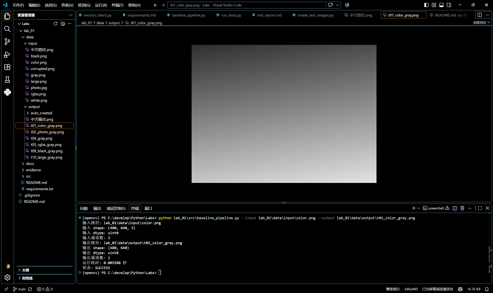
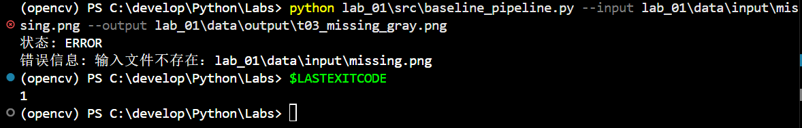
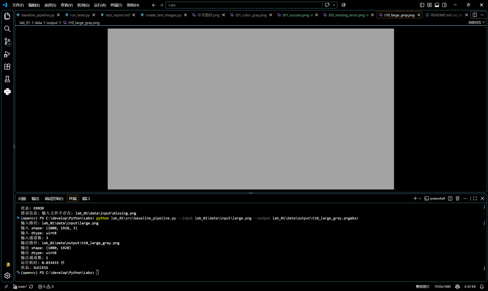

# 实验一测试报告

## 1 测试目的

验证基线程序能否正确读取不同格式和通道数量的图像，完成灰度转换和结果保存，并在输入不存在、文件损坏等情况下给出明确错误信息。同时检查中文路径、自动创建输出目录和大尺寸图像处理性能。

## 2 测试环境

- 操作系统：Microsoft Windows 11 家庭版 中文版 64 位
- Python：3.12.14
- OpenCV：5.0.0
- NumPy：2.5.3
- Matplotlib：3.11.2
- 虚拟环境：Conda `opencv`
- 测试日期：2026-09-15

详细环境信息见 `docs/environment.md`。

## 3 测试方法

使用 `src/run_tests.py` 自动调用 `src/baseline_pipeline.py`。每个测试检查程序实际退出码是否符合预期。成功处理的测试还会重新读取输出图像，验证输出文件、shape、dtype 和像素范围。详细控制台输出保存在 `evidence/test_results.txt`。

测试命令：

```powershell
conda activate opencv
python lab_01\src\run_tests.py
```

## 4 测试结果

| 用例 | 输入条件 | 预期结果 | 实际结果 | 结论 |
| --- | --- | --- | --- | --- |
| T01 | 标准彩色 PNG | 输出 SUCCESS；识别三通道；生成灰度图 | 输入 shape 为 `(480, 640, 3)`；输出 shape 为 `(480, 640)`；耗时 0.040811 秒 | PASS |
| T02 | JPEG 图像 | 成功读取并保存灰度结果 | 成功生成单通道灰度图，退出码为 0 | PASS |
| T03 | 不存在的输入路径 | 输出 ERROR；退出码非 0 | 提示输入文件不存在，实际退出码为 1 | PASS |
| T04 | 灰度 PNG | 识别单通道且正常保存 | 未访问不存在的第三通道，成功保存结果 | PASS |
| T05 | RGBA PNG | 处理 Alpha 通道并生成灰度图 | 使用 BGRA 转灰度，成功生成单通道结果 | PASS |
| T06 | 中文路径 | 正确读取和保存中文路径文件 | 使用 Unicode 安全读写方式处理成功 | PASS |
| T07 | 损坏文件 | 提示读取失败；退出码非 0 | 提示文件可能不是有效图像，实际退出码为 1 | PASS |
| T08 | 输出目录不存在 | 自动创建目录并保存结果 | 成功创建 `auto_created` 目录并写入图像 | PASS |
| T09 | 全黑图像 | 程序正常，输出像素范围合理 | 成功处理，输出像素值保持为 0 | PASS |
| T10 | 1920×1080 大图像 | 处理时间不超过 2 秒 | 输出 shape 为 `(1080, 1920)`；耗时 0.024199 秒 | PASS |

## 5 结果分析

本次共执行 10 个测试，10 个全部通过。标准 PNG、JPEG、灰度图和 RGBA 图像均可正常处理，输出结果为单通道灰度图，宽度和高度与输入保持一致。

T03 和 T07 虽然产生错误状态，但这是程序对无效输入的预期处理结果。程序没有继续访问无效图像的 shape，而是输出明确错误信息并以状态码 1 退出，因此这两项属于异常处理通过，不属于程序缺陷。

T06 验证了 Windows 中文路径。测试图像最初使用 `cv2.imwrite` 直接写入时出现文件名乱码。修改为 `cv2.imencode` 配合 NumPy `tofile` 写入，并使用 NumPy `fromfile` 配合 `cv2.imdecode` 读取后，中文输入和输出路径均可正常使用。

T08 表明程序可以在输出目录不存在时自动创建目录。T10 对 1920×1080 图像的处理耗时为 0.024199 秒，低于 2 秒的性能要求。

## 6 测试结论

基线程序达到了实验一规定的图像读取、属性检查、灰度转换、结果保存和异常处理要求。功能需求、异常需求和主要非功能需求均已通过实际测试验证。

程序当前面向 PNG、JPEG、BMP 和 TIFF 等静态图像，不包含实时摄像头、复杂图像增强、目标识别和图形用户界面。

## 7 后续实验继承的接口约定

- 使用 `--input` 和 `--output` 传入输入、输出路径。
- 输入路径不得写死在源代码中。
- OpenCV 彩色图像采用 BGR 通道顺序。
- 灰度输出使用二维 NumPy 数组表示。
- 程序读取图像后必须检查返回结果、shape、dtype 和通道数。
- 原始输入保存在 `data/input`，程序输出保存在 `data/output`。
- 成功时返回状态码 0，失败时返回非零状态码并输出明确错误信息。
- 输出目录不存在时由程序自动创建。
- 中文路径使用 Unicode 安全的图像读写方式。

## 8 运行截图

### T01 标准彩色图处理成功



截图显示输入图像为三通道 `uint8` 数据，输出图像为相同宽高的单通道灰度图，程序状态为 `SUCCESS`。

### T03 输入路径不存在



截图显示程序检测到输入文件不存在，输出 `ERROR` 和明确错误信息，并以状态码 `1` 退出。

### T10 大尺寸图像性能



截图显示程序成功处理 1920×1080 彩色图像，生成相同宽高的灰度图，实际耗时低于 2 秒。