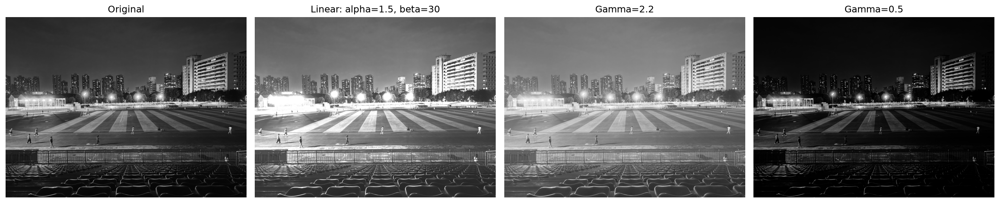
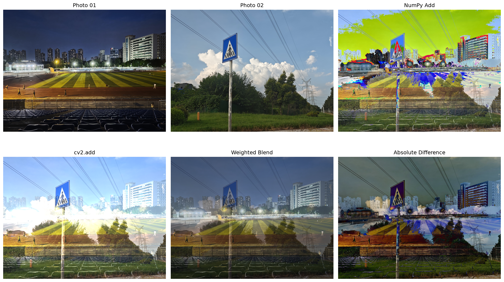
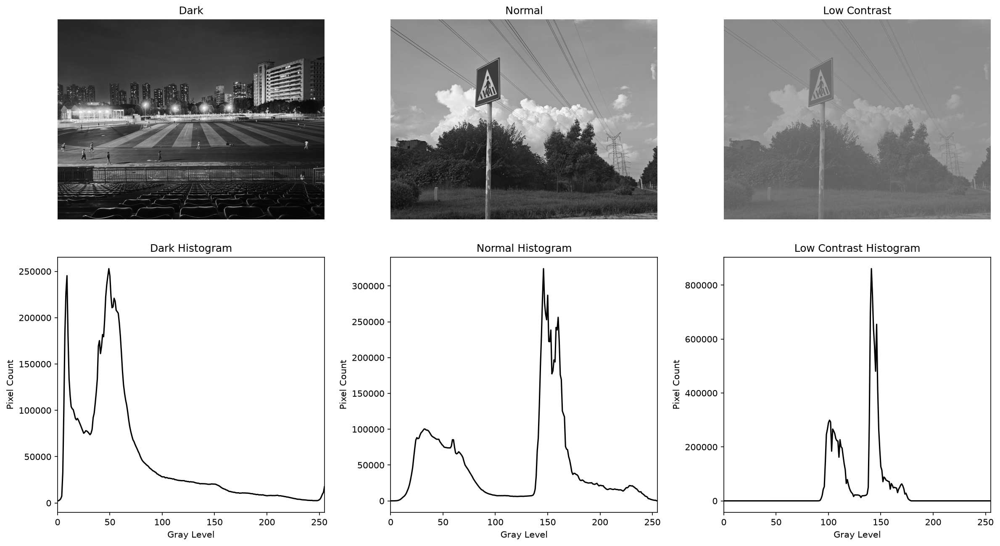
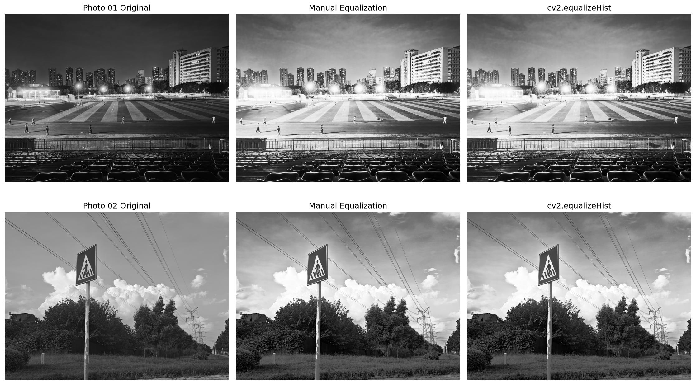
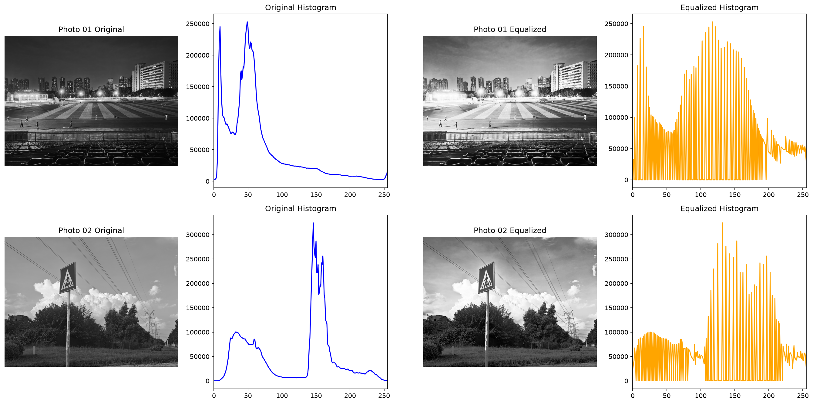

# 实验二 图像基本运算与直方图均衡化


## 1. 实验目的

1. 掌握图像线性变换和伽马校正方法。
2. 掌握图像加法、减法和加权混合运算。
3. 理解灰度直方图的含义，并使用 `cv2.calcHist` 进行统计。
4. 掌握直方图均衡化原理，比较手写实现与 OpenCV API 的结果。
5. 对实验一的需求清单进行评审，确定项目 MVP 范围。
6. 调研本实验使用的 OpenCV 官方 API。

## 2. 实验环境

- 操作系统：Windows
- Python 环境：Conda `opencv`
- OpenCV：5.0.0
- NumPy：2.5.3
- Matplotlib：3.11.2
- 输入图片尺寸：两张图片均为 4096×3072，三通道彩色图像

## 3. 灰度变换

源代码：`src/transform.py`

### 3.1 线性变换

线性变换公式为：

```text
out = alpha × img + beta
```

本实验设置：

```python
alpha = 1.5
beta = 30

linear = np.clip(
    alpha * img.astype(np.float32) + beta,
    0,
    255
).astype(np.uint8)
```

其中，`alpha` 用于调整对比度，`beta` 用于调整整体亮度。`np.clip` 将结果限制在 0 至 255，防止像素值越界。

### 3.2 伽马校正

本实验按照指导书规定使用以下公式：

```text
out = 255 × (img / 255)^(1 / gamma)
```

核心代码：

```python
normalized = image.astype(np.float32) / 255.0
corrected = 255 * (normalized ** (1 / gamma))
corrected = np.clip(corrected, 0, 255).astype(np.uint8)
```

实验分别使用 `gamma=2.2` 和 `gamma=0.5`。



### 3.3 结果分析

线性变换提高了图像的亮度和对比度，但原本较亮的灯光区域出现了饱和。按照本实验使用的公式，`gamma=2.2` 能够提亮暗部，使座椅和运动场区域的细节更明显；`gamma=0.5` 会压暗图像，使暗部细节减少。

## 4. 图像代数运算

源代码：`src/arith.py`

### 4.1 NumPy 加法与 OpenCV 加法

核心代码：

```python
add_np = np.add(a, b)
add_cv = cv2.add(a, b)
```

两张输入图像均为 `uint8` 类型。NumPy 加法超过 255 后会按模 256 回绕，而 `cv2.add` 会把超过 255 的结果截断为 255。

### 4.2 加权混合与差值

```python
blend = cv2.addWeighted(a, 0.6, b, 0.4, 0)
difference = cv2.absdiff(a, b)
```

加权混合结果由第一张图的 60% 和第二张图的 40% 组成。`cv2.absdiff` 计算两张图对应像素的绝对差值。



### 4.3 结果分析

实验中 NumPy 加法与 `cv2.add` 不同的通道值占比为 `22.66%`。NumPy 加法在较亮区域出现绿色、红色等异常色块，说明像素值发生了回绕。`cv2.add` 的高亮区域变白，符合饱和运算的特征。

两张照片拍摄的场景不同，因此加权混合图中可以同时看到两个场景，差值图也包含较大范围的变化。该结果能够展示图像逐像素运算的效果。

## 5. 灰度直方图

源代码：`src/hist_equalize.py`

直方图使用以下代码计算：

```python
hist = cv2.calcHist(
    [image],
    [0],
    None,
    [256],
    [0, 256]
)
```

为了比较暗图、正常图和低对比度图，本实验通过缩小灰度范围生成人工低对比度图：

```python
low_contrast = np.clip(
    normal.astype(np.float32) * 0.35 + 90,
    0,
    255
).astype(np.uint8)
```



### 5.1 结果分析

- 暗图的像素较多分布在低灰度区域，同时因为画面中存在灯光，也包含少量高灰度像素。
- 正常亮度图的灰度分布范围较宽，既有较暗的树木，也有较亮的天空和云层。
- 低对比度图的灰度值集中在较窄范围，因此图像整体发灰，明暗差异不明显。

直方图横轴表示灰度值，范围为 0 至 255；纵轴表示对应灰度值的像素数量。

## 6. 直方图均衡化

### 6.1 手写均衡化

手写方法先计算直方图和累计分布函数，再建立灰度查找表：

```python
hist = calc_hist(image)
cdf = hist.cumsum()

cdf_min = cdf[cdf > 0][0]
denominator = cdf[-1] - cdf_min

lookup_table = np.rint(
    (cdf - cdf_min) * 255 / denominator
)

lookup_table = np.clip(
    lookup_table,
    0,
    255
).astype(np.uint8)

manual = lookup_table[image]
```

### 6.2 OpenCV 均衡化

```python
api_result = cv2.equalizeHist(image)
```





### 6.3 结果分析

均衡化后，暗图的灰度范围被拉开，运动场、座椅和建筑等区域的细节更加明显。正常亮度图均衡化后对比度也有所提高，但部分区域的明暗变化变得较强，说明均衡化不一定能让所有图像在视觉上更自然。

本实验中手写均衡化结果与 `cv2.equalizeHist` 保存结果逐像素一致，说明 CDF 映射和取整方法正确。

均衡化后的直方图并不是每个灰度值都具有相同数量的像素。由于灰度映射是离散的，部分灰度级没有像素，部分灰度级会聚集较多像素，但整体分布范围比原图更宽。

## 7. 需求评审与 MVP 范围

需求评审记录见 `docs/mvp_review.md`。

本次预评审将需求分为“MVP”“可推迟”和“删除”三档。MVP 的核心范围是：

> 程序能够接收输入和输出路径，读取正常彩色图像，输出图像属性，将图像转换为灰度图，自动创建输出目录并保存结果，同时处理常见的读取和保存错误。

灰度图兼容和特殊图像形状处理被列为可推迟需求。本轮没有删除与项目目标直接相关的需求。

当前文档记录的是预评审结果，课堂小组互评后还需要补充至少三条真实评审意见。

## 8. OpenCV API 调研

API 调研记录见 `docs/api_notes.md`，内容包括：

- `cv2.calcHist`
- `cv2.equalizeHist`
- `cv2.addWeighted`

文档记录了三个函数的官方签名、关键参数、实验用法和官方文档来源。

## 9. 实验总结

本实验完成了线性变换、伽马校正、图像加法、加权混合、图像差值、灰度直方图统计以及直方图均衡化。

实验结果表明：

1. 线性变换可以同时改变对比度和亮度，但需要注意像素饱和。
2. NumPy 的 `uint8` 加法与 OpenCV 饱和加法具有明显不同的溢出行为。
3. 直方图能够直观反映图像的亮度和对比度分布。
4. 直方图均衡化能够扩展灰度范围，但对于原本对比度正常的图像可能产生较强的增强效果。
5. 手写 CDF 均衡化结果与 OpenCV API 结果一致，加深了对均衡化原理的理解。