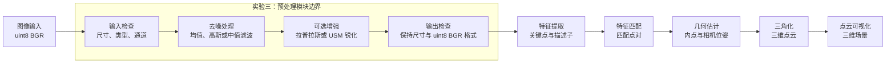

# SFM 系统架构与数据流设计

## 1. 设计目标

本系统按照“图像输入、预处理、特征提取、特征匹配、几何估计、三角化、点云可视化”的顺序处理图像。

实验三负责其中的预处理模块。该模块在特征提取之前降低噪声或增强边缘，为后续特征检测与匹配提供质量更稳定的图像。

## 2. SFM 系统数据流图

## 3. 各模块输入与输出

| 模块 | 输入 | 输出 |
| --- | --- | --- |
| 图像输入 | 图片文件路径 | `uint8 BGR` 图像 |
| 预处理 | `uint8 BGR` 图像、配置字典 | 去噪或增强后的 `uint8 BGR` 图像 |
| 特征提取 | 预处理后的图像 | 关键点、描述子 |
| 特征匹配 | 两幅图像的描述子 | 匹配点对 |
| 几何估计 | 匹配点对、相机参数 | 内点、基础矩阵或本质矩阵、相机位姿 |
| 三角化 | 相机位姿、内点对应关系 | 三维点坐标与颜色 |
| 点云可视化 | 三维点坐标与颜色 | 可交互的三维场景 |

## 4. 实验三预处理模块边界

### 输入

- 图像：`numpy.ndarray`。
- 图像格式：`uint8 BGR`。
- 配置：`dict`，用于指定滤波方法、核大小、锐化方法和增强系数。

### 模块内部处理

1. 检查图像是否为空，并验证数据类型与通道数。
2. 根据噪声类型选择均值、高斯或中值滤波。
3. 根据需要选择拉普拉斯或 USM 锐化。
4. 将结果限制在 `0～255`，并保持 `uint8` 类型。

### 输出

- 去噪或增强后的 `numpy.ndarray`。
- 图像尺寸与输入保持一致。
- 数据格式保持为 `uint8 BGR`，供特征提取模块直接使用。

## 5. 实验代码与系统接口的区别

本实验为了便于观察滤波效果以及计算 PSNR、SSIM，使用灰度图完成噪声生成和定量评价。

正式接入 SFM 系统时，预处理接口接收并返回 `uint8 BGR` 图像。这样可以保留颜色信息，并与后续模块约定的数据格式一致。
