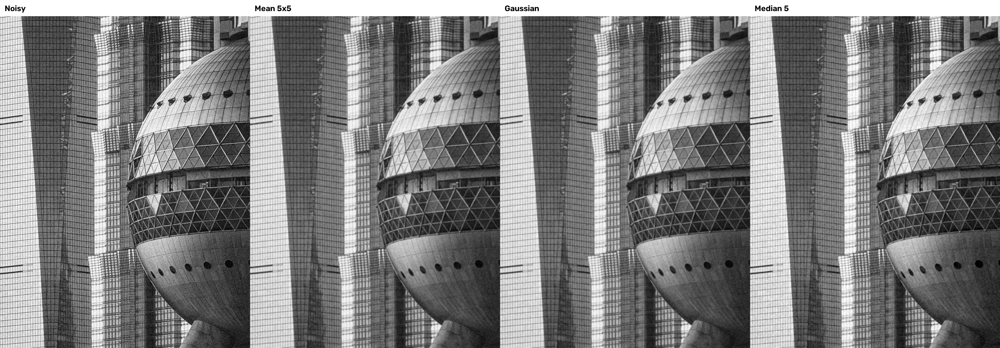
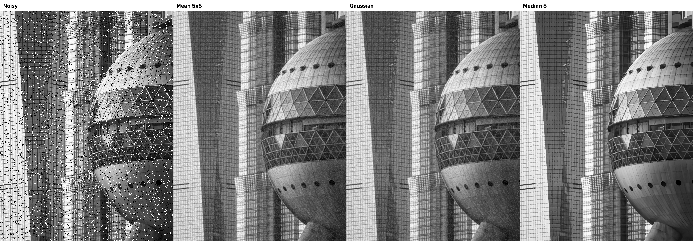
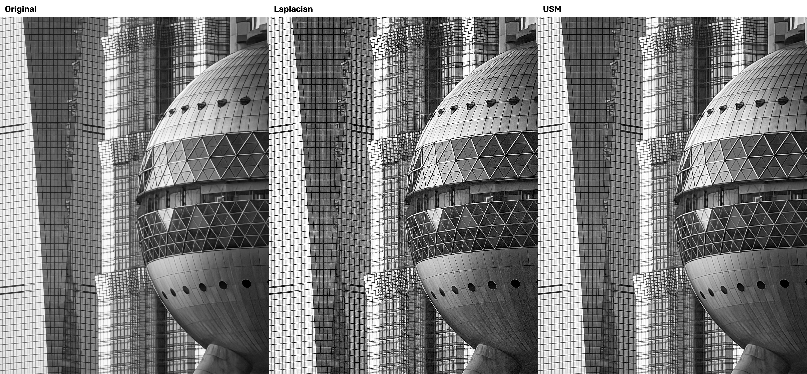

# 实验三：空间滤波与图像增强实验报告

## 1. 实验目的

1. 理解卷积与空间滤波原理，掌握均值、高斯和中值滤波的适用场景。
2. 掌握拉普拉斯锐化和 USM 锐化方法。
3. 使用 PSNR 和 SSIM 定量评价图像处理效果。
4. 绘制 SFM 数据流图，明确预处理模块边界并约定统一接口。

## 2. 实验环境

| 项目 | 实际环境 |
| --- | --- |
| 操作系统 | Windows |
| 开发工具 | Visual Studio Code |
| Python 环境 | Conda `opencv` |
| Python | 3.12.14 |
| OpenCV | 5.0.0 |
| NumPy | 2.5.3 |
| scikit-image | 0.26.0 |
| 输入图像尺寸 | 1434 × 1080 |

## 3. 实验数据与参数

实验图片包含玻璃幕墙网格、球体轮廓、直线和曲线，纹理与边缘丰富，适合观察滤波造成的细节变化以及锐化后的边缘增强效果。

| 处理项目 | 参数 |
| --- | --- |
| 高斯噪声 | 均值 0，标准差 25 |
| 椒盐噪声 | 5% 黑点，5% 白点 |
| 均值滤波 | 5 × 5 核 |
| 高斯滤波 | σ = 1.5 |
| 中值滤波 | 核大小为 5 |
| 拉普拉斯锐化 | 增强系数 0.8 |
| USM 锐化 | 原图 × 1.6 - 模糊图 × 0.6，模糊 σ = 2.0 |
| 随机数种子 | 0 |

固定随机数种子可以保证每次运行生成相同噪声，使实验结果可以重复比较。

## 4. 实验方法

### 4.1 噪声生成

程序以灰度模式读取原图。高斯噪声由 NumPy 随机数生成器产生，加入原图后将像素限制到 0～255，并转换回 `uint8`。椒盐噪声通过随机掩膜生成，将 5% 的像素置为 0，另外 5% 置为 255。

### 4.2 空间滤波

对两类含噪图分别执行均值、高斯和中值滤波，两组实验采用相同参数。均值滤波可以平滑噪声但容易模糊边缘；高斯滤波按距离分配邻域权重；中值滤波使用邻域中值替换中心像素，特别适合椒盐噪声。

### 4.3 图像锐化

拉普拉斯锐化利用二阶导数突出灰度快速变化区域，并采用 0.8 的增强系数。USM 先进行高斯模糊，再放大原图与模糊图的差异，从而增强边缘和纹理。

### 4.4 质量评价

以无噪声灰度原图为参考，计算含噪图及滤波结果的 PSNR 与 SSIM：

```text
PSNR = 10 × log10(255² / MSE)
```

PSNR 越大，结果与原图越接近；SSIM 越接近 1，图像结构越相似。

## 5. 实验结果

### 5.1 高斯噪声滤波对比



均值滤波能够降低噪声，但建筑网格和球体边缘较模糊。高斯滤波在降低噪声的同时较好地保留了边缘。中值滤波仍保留部分颗粒，不是本组参数下处理高斯噪声的最佳方法。

### 5.2 椒盐噪声滤波对比



均值和高斯滤波会将部分黑白噪点扩散成灰斑。中值滤波能够去除黑白散点并较好保留建筑网格和球体轮廓，因此处理椒盐噪声的效果最好。

### 5.3 锐化效果对比



拉普拉斯锐化增强效果较强，但容易产生过冲或放大局部噪声。USM 锐化后的边缘与纹理更加清晰，整体过渡较自然。

### 5.4 PSNR 与 SSIM 评分表

| 噪声类型 | 处理方法 | PSNR/dB | SSIM |
| --- | --- | ---: | ---: |
| 高斯噪声 | 含噪图 | 20.47 | 0.5373 |
| 高斯噪声 | 均值滤波 | 22.63 | 0.6607 |
| 高斯噪声 | 高斯滤波 | 23.63 | 0.7287 |
| 高斯噪声 | 中值滤波 | 23.08 | 0.6689 |
| 椒盐噪声 | 含噪图 | 15.02 | 0.3529 |
| 椒盐噪声 | 均值滤波 | 21.44 | 0.5678 |
| 椒盐噪声 | 高斯滤波 | 22.18 | 0.6354 |
| 椒盐噪声 | 中值滤波 | 23.90 | 0.7976 |

完整数据保存在 `results/metrics.csv`。

## 6. 结果分析

对于高斯噪声，高斯滤波取得最高的 PSNR 23.63 dB 和 SSIM 0.7287。这说明高斯滤波更符合高斯噪声的分布特点，在平滑随机灰度波动时能够较好保留图像结构。

对于椒盐噪声，中值滤波取得最高的 PSNR 23.90 dB 和 SSIM 0.7976。中值滤波不直接计算邻域平均值，因此能够排除极端黑白像素，并避免噪声向周围扩散。

实验说明不同噪声需要选择不同滤波器。滤波强度与边缘保留之间存在权衡，需要结合视觉效果、PSNR 和 SSIM 共同选择方法与参数。

## 7. 软件工程设计

### 7.1 SFM 系统架构

```text
图像输入 → 预处理 → 特征提取 → 特征匹配
→ 几何估计 → 三角化 → 点云可视化
```

完整数据流图和模块边界记录在 `docs/architecture.md`。

### 7.2 预处理接口

```python
def preprocess(
    img_bgr: np.ndarray,
    cfg: dict,
) -> np.ndarray:
```

接口输入和输出均为 `uint8 BGR` 图像，输出尺寸与输入一致。接口按照“先去噪、后锐化”的顺序处理图像。配置字段和异常规则记录在 `docs/interface_agreement.md`。

实际验证结果为：

```text
接口输入格式：(1434, 1080, 3) uint8
接口输出格式：(1434, 1080, 3) uint8
```

接口成功完成“读取 BGR 图像、高斯去噪、USM 锐化、保存结果”的完整流程，结果保存在 `results/preprocessed_bgr.jpg`。

## 8. 实验结论

1. 均值、高斯和中值滤波均能降低噪声，但适用场景不同。
2. 高斯滤波处理高斯噪声的综合效果最好。
3. 中值滤波处理椒盐噪声的效果最好。
4. 拉普拉斯与 USM 均能增强边缘，其中 USM 的整体效果更自然。
5. PSNR 和 SSIM 能为滤波方法选择提供定量依据。
6. 预处理模块已按统一 BGR 接口完成封装，可供后续 SFM 模块调用。
