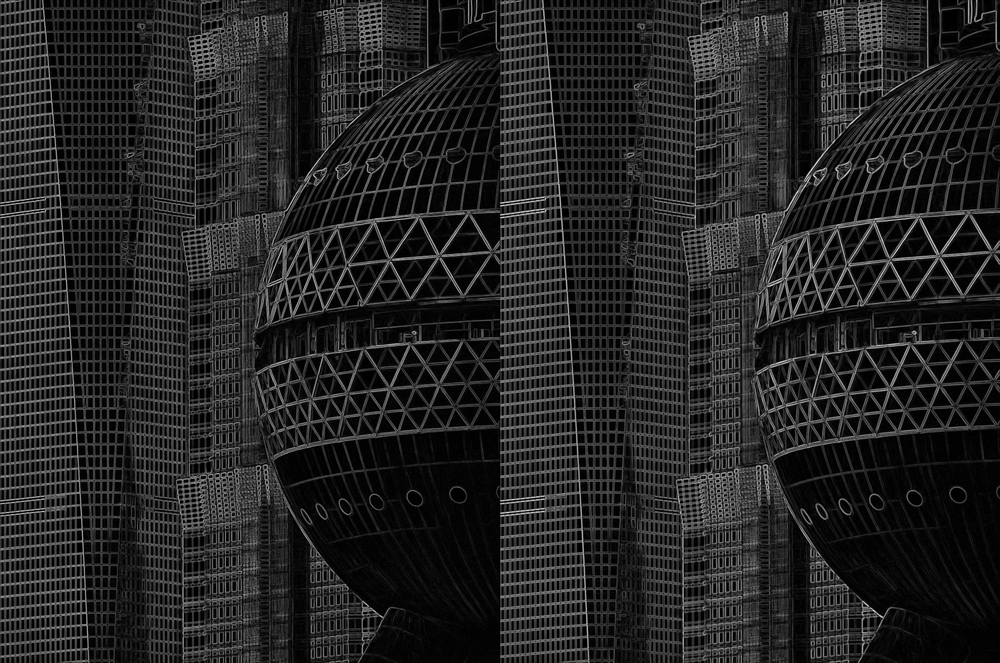
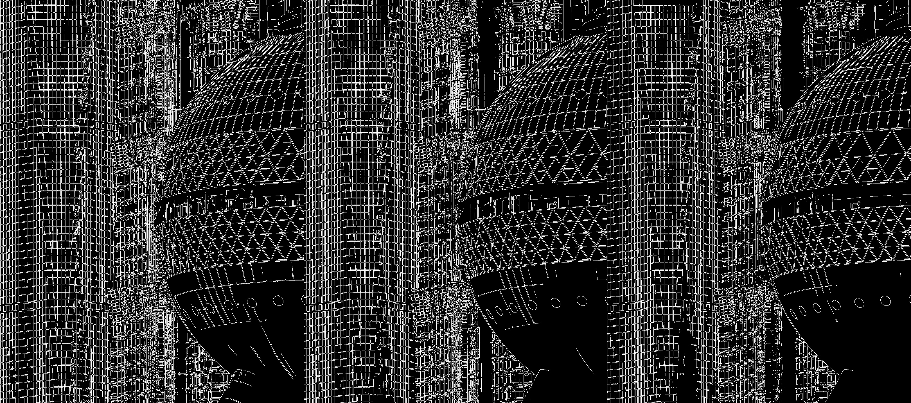
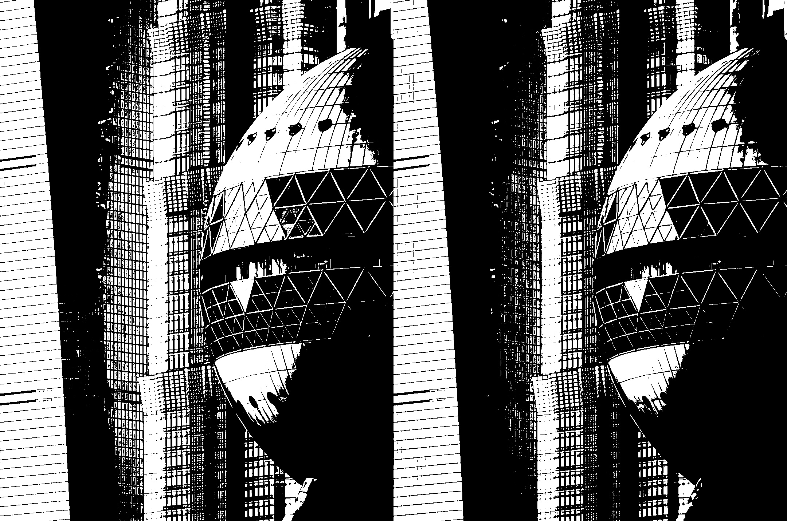
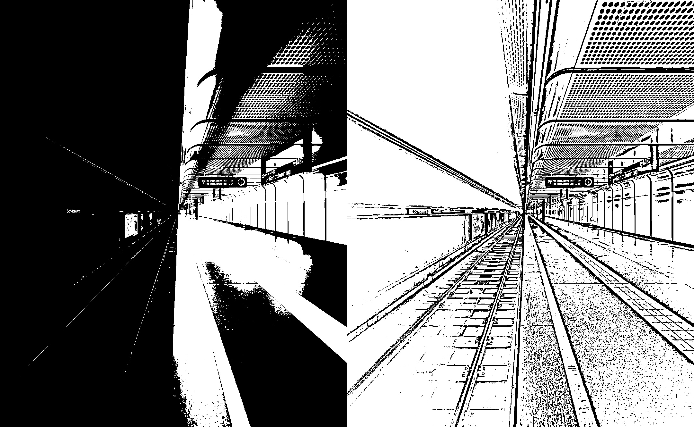

# 实验四 边缘检测与图像分割实验报告

## 一 实验信息

- 实验名称：边缘检测与图像分割
- 姓名：已隐去
- 学号：已隐去
- 班级：已隐去
- 实验日期：2026 年 9 月 29 日

## 二 实验目的

1. 掌握 Sobel 算子的基本原理和梯度幅值的计算方法。
2. 理解 Sobel 卷积核尺寸对边缘检测结果的影响。
3. 掌握 Canny 边缘检测方法和双阈值参数的作用。
4. 掌握固定阈值和 Otsu 自动阈值分割方法。
5. 理解自适应阈值在光照不均图像中的作用。
6. 完成函数级详细设计、编码规范和设计走查。

## 三 实验环境

- 操作系统：Windows
- 编程语言：Python
- 开发工具：Visual Studio Code
- 图像处理库：OpenCV
- 数值计算库：NumPy

## 四 实验原理

### 4.1 Sobel 梯度

图像边缘通常出现在灰度变化明显的位置。Sobel 算子通过卷积近似计算图像在 x 方向和 y 方向的偏导数。

x 方向梯度记为 Gx，y 方向梯度记为 Gy，综合梯度幅值为：

    G = sqrt(Gx² + Gy²)

梯度幅值越大，说明该位置的灰度变化越明显，因此越可能属于图像边缘。

本实验分别使用大小为 3 和 5 的 Sobel 卷积核，比较不同核尺寸对检测结果的影响。

### 4.2 Canny 边缘检测

Canny 边缘检测主要包括以下步骤：

1. 使用高斯滤波减少图像噪声。
2. 使用 Sobel 算子计算梯度幅值和方向。
3. 使用非极大值抑制细化边缘。
4. 使用双阈值和滞后连接保留有效边缘。

低阈值用于判断可能的弱边缘，高阈值用于判断确定的强边缘。位于两个阈值之间并且与强边缘相连的像素也会被保留。

### 4.3 固定阈值分割

固定阈值分割对整张图像使用同一个阈值 T：

- 灰度值大于 T 的像素设置为 255。
- 灰度值小于或等于 T 的像素设置为 0。

本实验的固定阈值设置为 128。

### 4.4 Otsu 自动阈值

Otsu 方法会遍历可能的阈值，选择使前景和背景类间方差最大的阈值。它不需要人工指定具体阈值，适合灰度直方图接近双峰分布的图像。

### 4.5 自适应阈值

全局阈值对整张图像使用同一个阈值，在光照不均的情况下容易使部分区域过黑或过白。

自适应阈值根据每个像素附近区域的灰度统计信息计算局部阈值，因此更适合处理一侧较亮、一侧较暗的图像。

## 五 实验步骤

### 5.1 准备实验图片

本实验准备了两张图片：

- `photo01.jpg`：纹理和建筑轮廓清晰，用于 Sobel、Canny和全局阈值实验。
- `photo02.jpg`：左右两侧明暗差异明显，用于自适应阈值实验。

### 5.2 Sobel 梯度实验

1. 以灰度模式读取 `photo01.jpg`。
2. 分别使用大小为 3 和 5 的 Sobel 卷积核。
3. 计算 x、y 两个方向的梯度。
4. 计算综合梯度幅值。
5. 将幅值归一化到 0～255。
6. 保存单独结果和水平对比图。

### 5.3 Canny 参数实验

分别使用以下三组双阈值：

- `(50,150)`
- `(100,200)`
- `(150,250)`

保存每组检测结果，并统计边缘像素占整张图像的比例。

### 5.4 固定阈值与 Otsu 实验

1. 使用固定阈值 128 进行二值分割。
2. 使用 Otsu 方法自动选择阈值。
3. 输出 Otsu 阈值。
4. 保存两种方法的结果和对比图。

### 5.5 自适应阈值实验

1. 读取光照不均的 `photo02.jpg`。
2. 使用全局 Otsu 方法进行分割。
3. 使用高斯加权自适应阈值进行分割。
4. 自适应阈值的邻域大小设置为 31，常量 C 设置为 5。
5. 保存两种方法的对比结果。

## 六 实验结果与分析

### 6.1 Sobel 卷积核对比

对比图左侧为 `ksize=3`，右侧为 `ksize=5`。

两种参数都能提取建筑物的轮廓和表面纹理。`ksize=3` 保留的局部细节较多，边缘相对较细；`ksize=5` 考虑的邻域范围更大，主要轮廓更加明显，但部分边缘变粗。

这说明较小的卷积核适合保留细节，较大的卷积核具有更强的平滑效果。

### 6.2 Canny 双阈值对比

对比图从左到右依次为 `(50,150)`、`(100,200)` 和 `(150,250)`。

实验测得的边缘密度如下：

| 低阈值 | 高阈值 | 边缘密度 |
|---:|---:|---:|
| 50 | 150 | 19.06% |
| 100 | 200 | 17.65% |
| 150 | 250 | 16.06% |

随着双阈值升高，边缘密度逐渐降低。`(50,150)` 能检测出更多弱边缘，但画面中的细碎纹理也更多；`(150,250)` 主要保留较强边缘，但会丢失部分较弱结构。

综合观察，本图使用 `(100,200)` 能在边缘完整程度和画面简洁程度之间取得较好的平衡。

### 6.3 固定阈值与 Otsu 对比

对比图左侧使用固定阈值 128，右侧使用 Otsu 自动阈值。程序计算出的 Otsu 阈值为 142。

两种方法的主体分割结果相近，但部分中间灰度区域存在差异。固定阈值 128 依赖人工设置，换一张亮度不同的图片后可能需要重新调整。Otsu 根据当前图像的灰度分布自动选择阈值，减少了人工试参过程。

Otsu 并非适合所有图片。如果图像的灰度分布不是近似双峰，分割结果仍可能不理想。

### 6.4 全局 Otsu 与自适应阈值对比

对比图左侧为全局 Otsu，右侧为自适应阈值。光照不均图片的 Otsu 自动阈值为 89。

全局 Otsu 对整张图片使用同一个阈值，导致较暗的左侧区域大面积变为黑色，轨道和墙面的部分结构丢失。

自适应阈值根据局部亮度计算阈值，在较暗区域中仍保留了轨道、墙面和指示牌等结构，但同时产生了一些细碎纹理。这说明自适应阈值能够改善光照不均造成的全局分割失败，但其邻域大小和常量 C 仍需要结合图像调整。

## 七 常见问题与处理

### 7.1 Sobel 结果过黑

原因：Sobel 梯度包含正值和负值，如果直接转换为 `uint8`，负值信息会丢失。

处理方法：先计算综合梯度幅值，再归一化到 0～255，最后转换为 `uint8`。

### 7.2 图片无法读取

原因：图片路径错误、文件不存在或文件损坏。

处理方法：根据脚本位置构造完整路径，并在读取后检查结果是否为空。

### 7.3 自适应阈值参数错误

原因：`adaptiveThreshold` 要求输入为灰度图，并且邻域大小必须是大于 1 的奇数。

处理方法：以灰度模式读取图片，并将邻域大小设置为 31。

## 八 软件工程实践

本实验将图片读取、图片保存和各项图像处理任务分别封装为函数，避免重复代码，并使每个函数只承担一项主要职责。

详细设计记录在 `detailed_design.md` 中，编码规范和走查意见记录在 `coding_standards.md` 中。

当前走查记录包含路径设计、图片读取检查、Canny 结果比较和 Sobel 数据类型处理等意见。实际小组互查后，还需要填写走查人和走查日期。

## 九 实验结论

1. Sobel 算子能够通过灰度梯度提取图像边缘。
2. 较小的 Sobel 核保留更多细节，较大的核得到的边缘更明显但更粗。
3. Canny 阈值越高，检测出的边缘越少。
4. Otsu 可以根据图像灰度分布自动选择全局阈值。
5. 全局阈值难以同时处理明暗差异明显的区域。
6. 自适应阈值能保留光照不均区域中的更多局部结构，但可能引入细碎纹理。
7. 模块化设计和统一的异常处理提高了程序的可读性和可维护性。

## 十 实验体会

通过本实验，我理解了边缘检测和阈值分割关注的问题并不相同。Sobel 和 Canny 主要寻找灰度变化明显的位置，而阈值分割主要根据像素灰度划分区域。

在比较不同参数时，我发现不能只判断结果是否“清晰”，还需要结合边缘密度、细节保留程度和噪声情况进行分析。光照不均图片的对比也说明，同一个全局阈值很难适应整张图像，自适应阈值更适合局部亮度差异明显的场景。